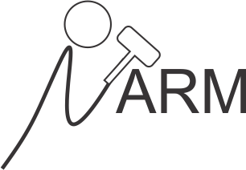

# uARMSolver - universal Association Rule Mining Solver


<p align="center">
  
</p>

[](https://aur.archlinux.org/packages/uarmsolver)
[](https://src.fedoraproject.org/rpms/uARMSolver)

## Description

The framework is written fully in C++ and runs on all platforms. It allows users to preprocess their data in a transaction database, to make discretization of data, to search for association rules and to guide a presentation/visualization of the best rules found using external tools. As opposed to the existing software packages or frameworks, this also supports numerical and real-valued types of attributes besides the categorical ones. Mining the association rules is defined as an optimization and solved using the nature-inspired algorithms that can be incorporated easily. Because the algorithms normally discover a huge amount of association rules, the framework enables a modular inclusion of so-called visual guiders for extracting the knowledge hidden in data, and visualize these using external tools.

## Compiling

    make

## Installation

To install uARMSolver on Fedora, use:

```sh
$ dnf install uARMSolver
```
To install uARMSolver on RHEL, CentOS, Scientific Linux enable EPEL 8 and use:

```sh
$ dnf install uARMSolver
```
To install uARMSolver on [Arch-based distributions](https://wiki.archlinux.org/title/Arch-based_distributions#Active), please use an [AUR helper](https://wiki.archlinux.org/title/AUR_helpers):

```sh
$ yay -Syyu uarmsolver
```
To install uARMSolver on Alpine Linux, please enable Community repository and use:

```sh
$ apk add uarmsolver
```
To install uARMSolver on Windows, please follow to the [following instructions](WINDOWS_INSTALLATION.md).


## Run example

    ./uARMSolver -s arm.set

arm.set is a problem definition file. Check [README](bin/README.txt)
 for more details about the format of .set file.

## Reference Papers (software is based on ideas from):

[1] I. Fister Jr., A. Iglesias, A. Gálvez, J. Del Ser, E. Osaba, I Fister. [Differential evolution for association rule mining using categorical and numerical attributes](http://www.iztok-jr-fister.eu/static/publications/231.pdf) In: Intelligent data engineering and automated learning - IDEAL 2018, pp. 79-88, 2018.

[2] I. Fister Jr., I Fister. Information cartography in association rule mining. arXiv preprint [arXiv:2003.00348](https://arxiv.org/abs/2003.00348), 2020.

[3] I. Fister Jr., V. Podgorelec, I. Fister. Improved Nature-Inspired Algorithms for Numeric Association Rule Mining. In: Vasant P., Zelinka I., Weber GW. (eds) Intelligent Computing and Optimization. ICO 2020. Advances in Intelligent Systems and Computing, vol 1324. Springer, Cham.


## Contributors

Iztok Fister, Iztok Fister Jr.

## License

This package is distributed under the MIT License. This license can be found online at <http://www.opensource.org/licenses/MIT>.

## Disclaimer

This framework is provided as-is, and there are no guarantees that it fits your purposes or that it is bug-free. Use it at your own risk!

## Cite us

I. Fister, I Fister Jr. uARMSolver: A framework for Association Rule Mining. arXiv preprint [arXiv:2010.10884](https://arxiv.org/abs/2010.10884), 2020.
